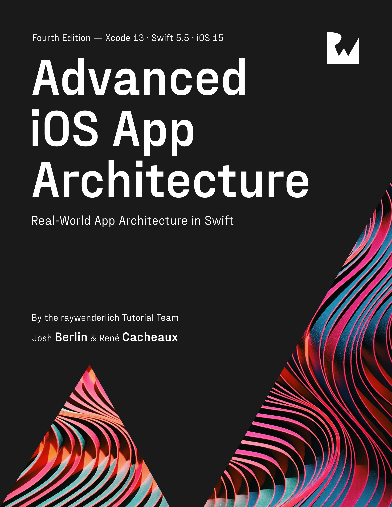
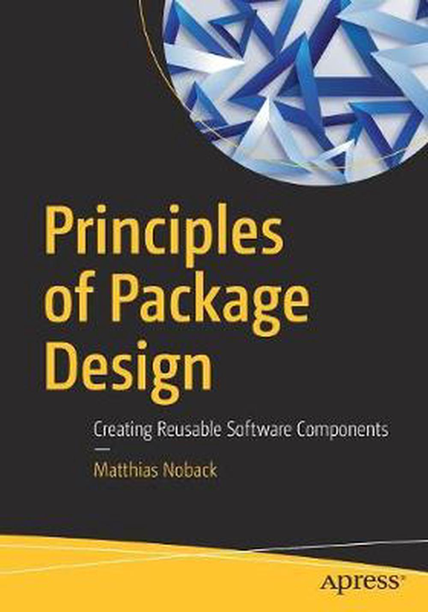
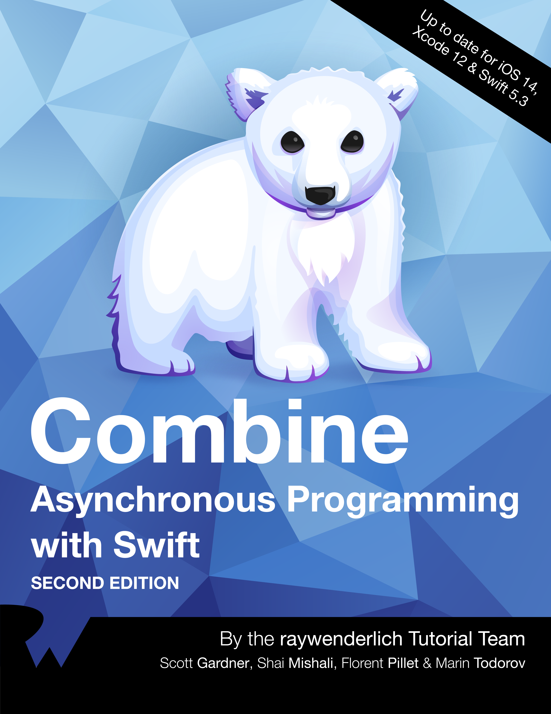
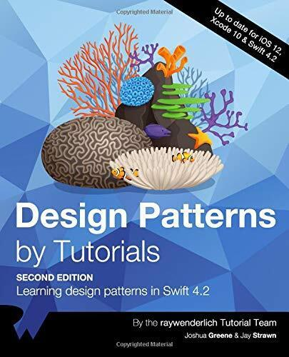
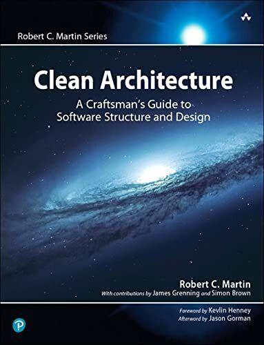
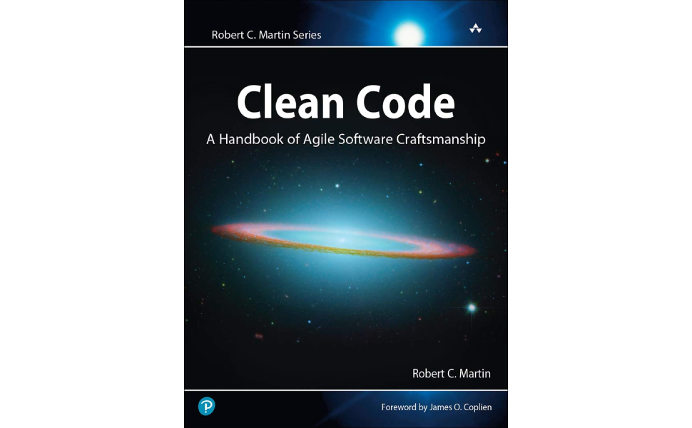
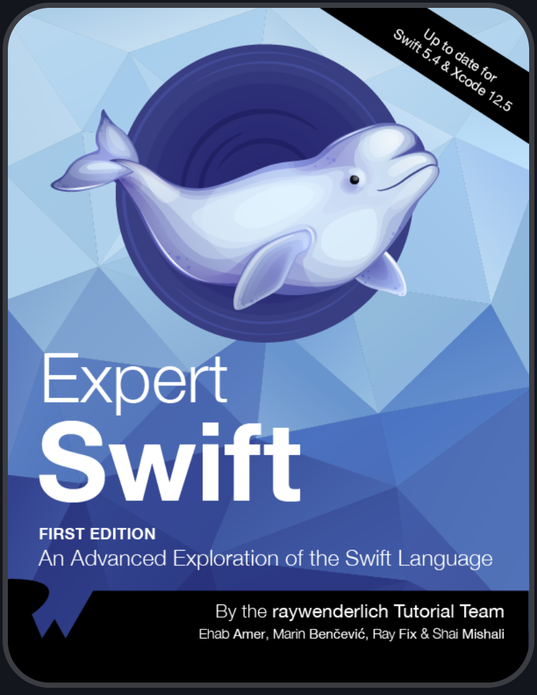

### 

- 🔭 I have 4.5 years of experience in iOS development.
- 🌱 Experienced in Fin-Tech, Food & Privilege and E-Commerce industries.
- ⭐️ I am Currently working on digital banking system at <a href="https://atos.net/en/">Atos </a> with the latest technologies.
- 💼 I’m looking to collaborate on open source projects that are using SwiftUI and Blockchain technology.
- 💬 Ask me about: Architecture design, Design Patterns, Reusable Components, Unit/UI Testing, CI/CD.
- 📫 How to contact with me: ramysabry1996@gmail.com
- 🔗 My Linkedin Profile: [Linkedin](https://www.linkedin.com/in/ramy-sabry-153770117)

### My books read for iOS 📚

 Advanced iOS App Architecture Book | Principles Of Package Design Book | Concurrency By Tutorials Book
:-------------------------:|:-------------------------:|:-------------------------:
 |   |  

Combine Book | Design Patterns By Tutorials Book | Clean Coder Book
:-------------------------:|:-------------------------:|:-------------------------:
 |   |  

Clean Architecture | Clean Code Book | Pro Git Book
:-------------------------:|:-------------------------:|:-------------------------:
 |   |  

Expert Swift |
:-------------------------:|
 |

### Github Stats 🥇

### Programming Language 😍

