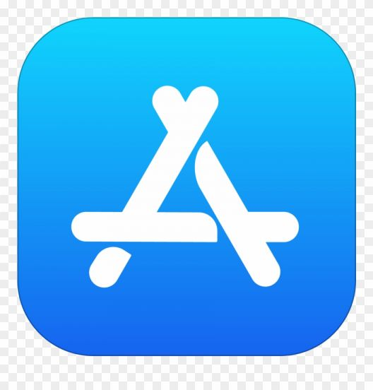

  

###   A little more about me...  

- I love developing iOS apps, also i am learning android development using kotlin & java.
- 💬 **Ask me about**: OOP, Swift, iOS, Cocoapods, Frameworks, RESTful APIs, Architecture, Design Patterns, Testing, and CI/CD.
- 📫 **How to reach me**: catch, and follow me from the above links 👆, in addition to follow me here.

 

### Technologies & Tools:

[][swift_website]
[][swiftui_website]
[][rxSwift_website]
[][kotlin_website]
[][xcode_website]
[][visualStudioCode_website]
[][androidStudio_website]
[][firebase_website]
[][swagger_website]
[][adobeXd_website]
[][figma_website]
[][zeplin_website]

    

[][githubActions_website]
[][fastlane_website]
[][jenkins_website]
[][appStore_website]
[][diawi_website]
[][firebaseAppDistribution_website]
[][testflight_website]

  
 

 <em>I love connecting with different people so if you want to say hi, I'll be happy to meet you more! :)</em>

⭐️ Thank you ⭐️

[linkedin_website]: https://www.linkedin.com/in/ramy-sabry-153770117/
[facebook_website]: https://www.facebook.com/profile.php?id=100008612291509

[swift_website]: https://developer.apple.com/swift/
[swiftui_website]: https://developer.apple.com/xcode/swiftui/
[rxSwift_website]: https://github.com/ReactiveX/RxSwift
[kotlin_website]: https://developer.android.com/kotlin/first
[xcode_website]: https://developer.apple.com/xcode/
[visualStudioCode_website]: https://code.visualstudio.com/
[androidStudio_website]: https://developer.android.com/studio
[firebase_website]: https://firebase.google.com/
[swagger_website]: https://swagger.io/
[adobeXd_website]: https://www.adobe.com/mena_en/products/xd.html
[figma_website]: https://www.figma.com/
[zeplin_website]: https://zeplin.io/
[githubActions_website]: https://github.com/features/actions
[fastlane_website]: https://fastlane.tools/
[jenkins_website]: https://www.jenkins.io/
[appStore_website]: https://www.apple.com/eg/app-store/
[diawi_website]: https://www.diawi.com/
[firebaseAppDistribution_website]: https://firebase.google.com/docs/app-distribution
[testflight_website]: https://developer.apple.com/testflight/